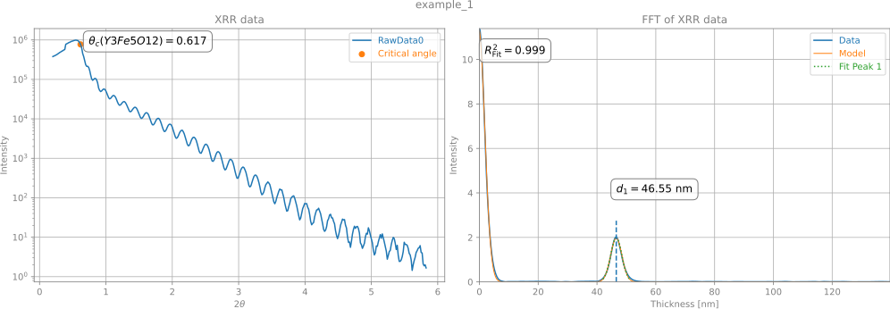

# XRR_FFT
Simple thickness determination of thin films from XRR (X-ray reflectometry) data from Fourier transforms.

# Installation
The code has very few dependencies. Simply run:
```python
pip install -r requirements.txt
```
This should work in most python environments without issues.

# Usage
See run_analysis.py for an example. Data parsers for Bruker .brml-files and Bruker .xy-files are included along with some example measurements. The only additional requirement is a crystallographic information file (.cif) of the thin film material.


# Acknowledgements
All the people putting their code and knowledge out there to the community are very much appreciated:
 - The brml-parser is a slight modification of the parser from [PyXRD](https://github.com/PyXRD/PyXRD), distributed under a FreeBSD-license.
 - The FFT implementation is based on: https://opara.zih.tu-dresden.de/xmlui/handle/123456789/1804  as described in the paper: [Fast Fourier transform and multi-Gaussian fitting of XRR data to determine the thickness of ALD grown thin films within the initial growth regime](https://doi.org/10.1063/5.0024991).
 - The code uses the [Dans_diffraction package](https://github.com/DanPorter/Dans_Diffraction), which is very useful for fundamental crystallography and diffraction problems.
